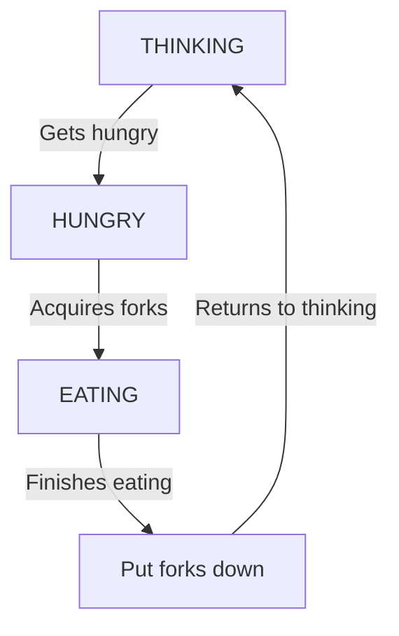

# Project-for-Operating-Systems-Course
Repository contains first project for OS course which is solution for Dining philosophers problem in [C](https://programmerhumor.io/programming-memes/c-programming/).


This repository contains a solution to the classic Dining Philosophers problem, implemented in C as part of an Operating Systems course.

# Dining Philosophers Problem Solution


## Problem Description
The Dining Philosophers problem illustrates synchronization challenges in concurrent systems:
- N philosophers sit at a round table with forks between them
- Each philosopher alternates between thinking and eating
- To eat, a philosopher needs both left and right forks
- The challenge is to prevent deadlocks and starvation

## Philosopher thread flow



## Solution Approach
This implementation uses:
- **POSIX threads** (`pthread`) for each philosopher
- **Mutex locks** for critical section protection; state change and uninterupted printing
- **Condition variables** for signaling available resources - signaling that forks can be taken and philosopher can start eating
- **State tracking** (THINKING, HUNGRY, EATING) to manage fork usage
- **Taking fork** is obtained by checking if left and right neighbour are not eating and tested philosopher is hungry
- **Putting down forks** calls test function on left and right neighbour to check if they are waiting


## Resources
- [Dining philosophers problem](https://en.wikipedia.org/wiki/Dining_philosophers_problem)
- [pthread_create](https://pubs.opengroup.org/onlinepubs/7908799/xsh/pthread_create.html)
- [usleep](https://www.man7.org/linux/man-pages/man3/usleep.3.html)
- [pthread_cond](https://docs.oracle.com/cd/E19455-01/806-5257/6je9h032r/index.html)

## Usage

```
cd Operating-Systems-Project
cmake -B out
cmake --build out
./out/dpp <number_of_philosophers>
```

To end program you will have use ```Ctrl^C```  (SIGINT), it gives summary of how long each philosopher ate and exits program.

## Output
For number of philospohers N = 5  
```
----------------------------
Philosopher 0 ate for 13755ms
Philosopher 1 ate for 14337ms
Philosopher 2 ate for 13185ms
Philosopher 3 ate for 16322ms
Philosopher 4 ate for 7261ms
```
